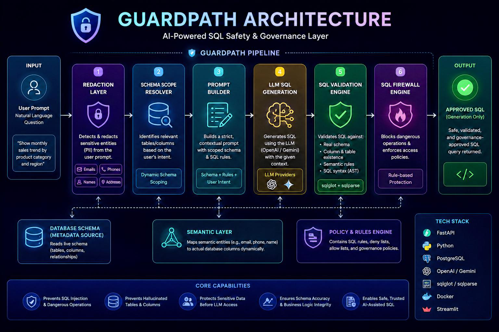

# GuardPath


**GuardPath** is an AI-powered SQL safety and governance layer designed to protect databases from unsafe, hallucinated, or unauthorized AI-generated queries.

The project was built in response to growing concerns around insecure AI-assisted data engineering workflows, especially in environments where sensitive data, governance, and trust are critical.

Instead of allowing Large Language Models (LLMs) to directly interact with databases, **GuardPath acts as a controlled middleware** that:
* **Validates** prompts
* **Scopes** database schemas
* **Prevents** hallucinated SQL
* **Blocks** dangerous operations
* **Detects** sensitive entities
* **Validates** generated SQL against the real schema
* **Returns** only approved SQL queries

> **Note:** GuardPath currently focuses on **safe SQL generation only**. It does **not execute SQL queries**.

---

## 🛑 Problem Statement

Modern AI tools can generate SQL very quickly, but they also introduce major risks:
* Hallucinated columns and tables
* Unsafe queries
* Exposure of sensitive data
* Broken joins
* Incorrect business logic
* Non-auditable AI-generated transformations

In industries like fintech, healthcare, telecom, and e-commerce, these failures can lead to **incorrect reporting, unfair automated decisions, data leaks, compliance violations, and financial losses.** GuardPath was built to reduce these risks by enforcing strict schema-aware validation before any AI-generated SQL is accepted.

---

## ✨ Key Features

### AI SQL Guardrails
Blocks dangerous SQL operations to ensure database integrity:
* `DROP`
* `DELETE`
* `TRUNCATE`
* `ALTER`
* `INSERT`
* `UPDATE`
* `GRANT`
* `REVOKE`

### Schema-Aware SQL Generation
GuardPath dynamically reads the database schema and ensures:
* Only **real tables** are used.
* Only **valid columns** are used.
* Relationships are **respected**.
* Hallucinated SQL is **rejected**.

### Dynamic Schema Scoping
The system automatically narrows the schema context based on the user's prompt. 
**Example Prompt:** *"Show product category with total sales per region"*
GuardPath automatically scopes relevant tables like `sales`, `product`, and `customer` instead of exposing the entire database schema to the LLM.

### SQL Validation Engine
Generated SQL is strictly validated using:
* **AST Parsing** (`sqlglot`)
* **Schema Validation**
* **Semantic Checks**
* **SQL Risk Analysis**

### Sensitive Data Protection
GuardPath includes a redaction layer that detects sensitive entities **before** prompts reach the LLM. 
Protected entities include:
* Names
* Emails
* Phone numbers
* Addresses

### Semantic Column Matching
The system supports semantic matching dynamically. For example, a prompt asking for *"customer names"* can safely map to `customer_name` without hardcoding database-specific rules.

### Dynamic Database Adaptation
GuardPath is designed to adapt dynamically to different database schemas. The architecture reads schema metadata directly from the connected database instead of relying on fixed rules. This allows the system to work across different industries and datasets with minimal changes.

---

## 🏗️ Project Architecture



**User Prompt** &nbsp;&nbsp;&nbsp;&nbsp;↓  
**Redaction Layer** &nbsp;&nbsp;&nbsp;&nbsp;↓  
**Schema Scope Resolver** &nbsp;&nbsp;&nbsp;&nbsp;↓  
**Prompt Builder** &nbsp;&nbsp;&nbsp;&nbsp;↓  
**LLM SQL Generation** &nbsp;&nbsp;&nbsp;&nbsp;↓  
**SQL Validator** &nbsp;&nbsp;&nbsp;&nbsp;↓  
**Firewall Engine** &nbsp;&nbsp;&nbsp;&nbsp;↓  
**Approved SQL Response** ---

## 💻 Tech Stack

* **Backend:** FastAPI, Python 3.10+
* **AI / LLM:** OpenAI, Gemini
* **SQL Parsing & Validation:** `sqlglot`, `sqlparse`
* **Containerization:** Docker, Docker Compose

---

## 📂 Folder Structure

```text
app/
│
├── api/
│   └── routes.py
│
├── llm/
│   ├── service.py
│   ├── openai_provider.py
│   └── gemini_provider.py
│
├── schemas/
│   └── prompt_schema.py
│
├── services/
│   ├── redactor.py
│   ├── schema_reader.py
│   ├── schema_graph.py
│   ├── prompt_builder.py
│   ├── sql_validator.py
│   └── sql_firewall/
│       ├── analyzer.py
│       ├── detector.py
│       ├── enforcer.py
│       └── engine.py
│
├── main.py
│
streamlit_app.py
Dockerfile
docker-compose.yml
requirements.txt
```
---

🚀 Running the Project

1. Clone the Repository

```Bash
git clone [https://github.com/GaniuKuku/guardpath.git]
cd guardpath
```

2. Install Dependencies

```Bash
pip install -r requirements.txt
```

3. Run FastAPI Backend

```Bash
uvicorn app.main:app --reload
```

4. Run Streamlit UI

```Bash
streamlit run streamlit_app.py
```

5. Docker Setup
Build Containers

```Bash
docker-compose build
```

6. Start Services

```Bash
docker-compose up
```
---

🎯 Current Scope
GuardPath currently focuses on:

Safe SQL generation

Schema-aware validation

AI governance

SQL risk prevention

(The project intentionally does not execute SQL queries.)
---

🔮 Future Improvements
Role-based SQL access control (RBAC)

Query execution sandbox

Audit logging dashboard

Data lineage tracking

Multi-database support

Local LLM integration

Policy-driven governance engine

AI explainability layer
---

🌍 Why This Project Matters
As AI becomes deeply integrated into data engineering workflows, unsafe AI-generated SQL and insecure data practices are becoming major risks. GuardPath explores how AI systems can be made safer, more transparent, and more accountable through schema-aware validation and governance-first design.

The project especially considers the growing importance of secure AI systems within emerging digital ecosystems across Africa.
